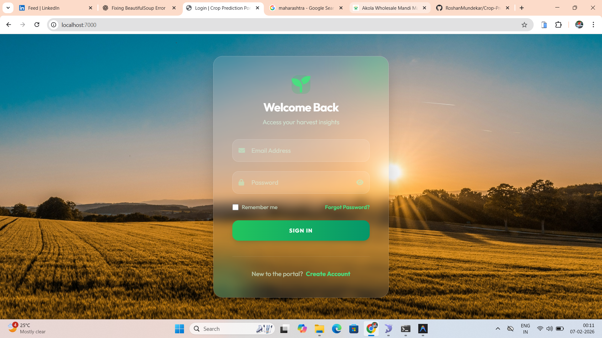
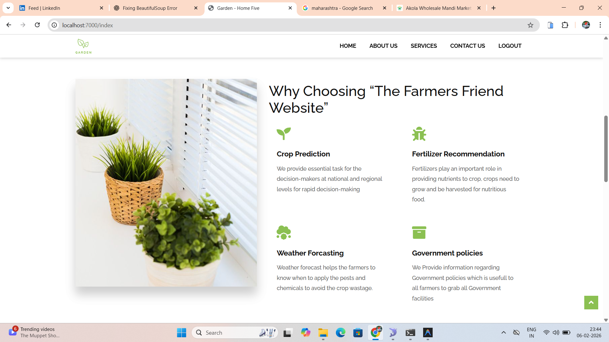
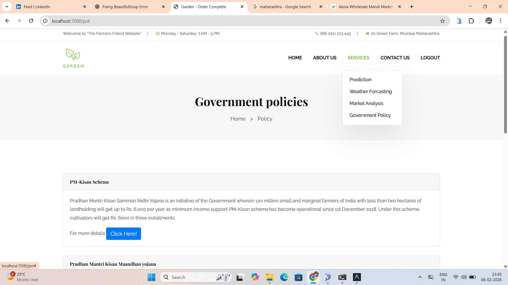
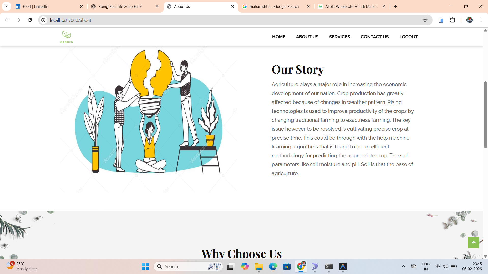

# Crop Prediction & Agricultural Portal

A comprehensive agricultural decision support system built with **Flask** and **Machine Learning**. This portal helps farmers optimize their crop yields, detect plant diseases, track market prices, and access essential farming resources.

## 🚀 Features

### 🌾 Crop Recommendation
Predicts the most suitable crop based on soil and environmental parameters (N, P, K, Temperature, Humidity, pH, and Moisture) using a Neural Network model.

### 🔍 Plant Disease Detection
Uses a Convolutional Neural Network (CNN) to identify diseases in crops like tomatoes, potatoes, and peppers from uploaded images.

### 📈 Market Price Analysis
Real-time web scraping provides current market prices (max, min, and average) for various commodities across different states and districts in India.

### 🌤️ Weather Services
Provides 3-day weather forecasts including temperature, humidity, and wind speed to help plan agricultural activities.

### 📍 Resource Locator
Helps find essential farming resources including:
- Seed Dealers
- Fertilizer Dealers
- Pesticide Dealers
- Cold Storage & Warehouses

### 👤 User Management
Secure registration and login system for personalized access.

## 🖼️ Visual Overview

### 🔐 Authentication (New Tailwind UI)

*Modern, responsive Login page with glassmorphism and agricultural theme.*


*Cohesive Registration page for new users.*

### 🏠 Dashboard & Features

*The welcoming landing page with agricultural inspiration.*


*Quick access to Crop Prediction, Fertilizer Recommendations, and more.*

### 📄 Information & Services

*Access to essential government schemes and policies.*


*Information about "The Farmers Friend" mission.*

## 🛠️ Technology Stack

- **Backend**: Python, Flask
- **Machine Learning**: TensorFlow, Keras, Scikit-learn
- **Database**: MySQL (MariaDB)
- **Frontend**: HTML5, CSS3, JavaScript, Bootstrap, Jinja2
- **Data Handling**: Pandas, NumPy
- **Scraping & API**: Requests, BeautifulSoup, OpenWeatherMap API

## 📋 Installation & Setup

1. **Clone the Repository**
   ```bash
   git clone <repository-url>
   cd Website_files
   ```

2. **Install Dependencies**
   ```bash
   pip install -r requirements.txt
   ```

3. **Database Configuration**
   - Import `newdb.sql` into your MySQL server.
   - Update the `dbConnection` function in `final_app.py` with your MySQL credentials.
   ```python
   def dbConnection():
       connection = pymysql.connect(
           host="localhost", user="root", password="your_password", database="cropnew", charset="utf8")
       return connection
   ```

4. **API Setup**
   - The project uses OpenWeatherMap API. Ensure your `API_KEY` is correctly set in `final_app.py`.

5. **Run the Application**
   ```bash
   python final_app.py
   ```
   The app will be accessible at `http://localhost:7000`.

## 📁 Project Structure

- `final_app.py`: Main application controller and routes.
- `weather.py`: Weather utility class.
- `templates/`: HTML templates for the web interface.
- `static/`: Static assets (CSS, JS, Images, Uploads).
- `models/`: Pre-trained ML models (.hp5 and .sav files).
- `newdb.sql`: Database schema.

## 📄 License
This project is for educational and practical agricultural support purposes.
